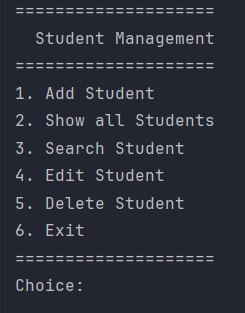
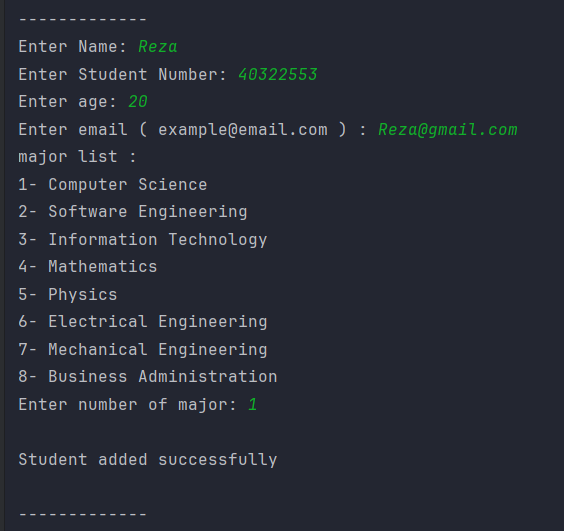
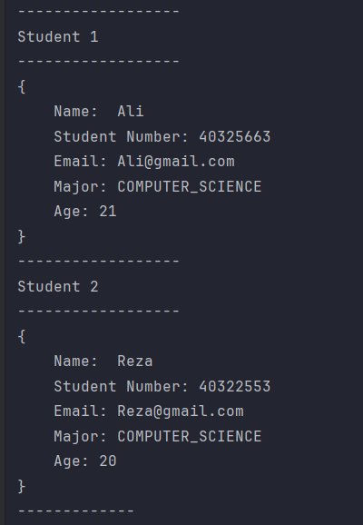
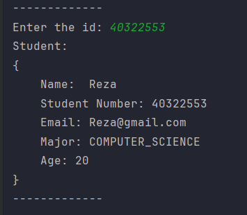

# 🎓 Student Management System
```markdown

A simple console-based **Student Management System** built with **Java**.

This project demonstrates object-oriented programming (OOP), input validation, enums, collections, and basic CRUD operations using a clean and organized project structure.
```

---

## ✨ Features

```

- ➕ Add a new student
- 📋 Display all students
- 🔍 Search students by student number
- ✏️ Edit student information
- 🗑️ Delete students
- ✅ Input validation for:
  - Student Number
  - Name
  - Email
  - Age
- 📦 Organized package structure

---

## 🛠 Technologies

- Java
- OOP (Object-Oriented Programming)
- Collections (`HashMap`)
- Enum
- Regular Expressions (Regex)
- Exception Handling

---


```
---

## 📸 Screenshots

### Main Menu



---

### Add Student



---

### Show Students



---

### Search Student




---

## 🚀 Getting Started

### Clone the repository

```bash
git clone https://github.com/rda27643/Student-Management-System.git
````

### Run the project

Compile and run the `Main` class.

No external libraries are required.

---

## 📚 Concepts Practiced

* Object-Oriented Programming
* Encapsulation
* Constructors
* Enums
* Collections API
* HashMap
* CRUD Operations
* Input Validation
* Regular Expressions
* Exception Handling
* Package Organization

---

## 📌 Validation Rules

| Field          | Validation                    |
| -------------- | ----------------------------- |
| Student Number | Exactly 8 digits              |
| Name           | Minimum 3 characters          |
| Email          | Must be a valid email address |
| Age            | Between 18 and 84             |

---

## 🎯 Future Improvements

* File persistence
* Database integration (MySQL)
* Search by name
* Sort students
* Update major
* Unit tests
* Logging
* GUI version with JavaFX or Swing
* REST API using Spring Boot

---

## 👨‍💻 Author

**Reza Abbasi**

GitHub: https://github.com/rda27643
